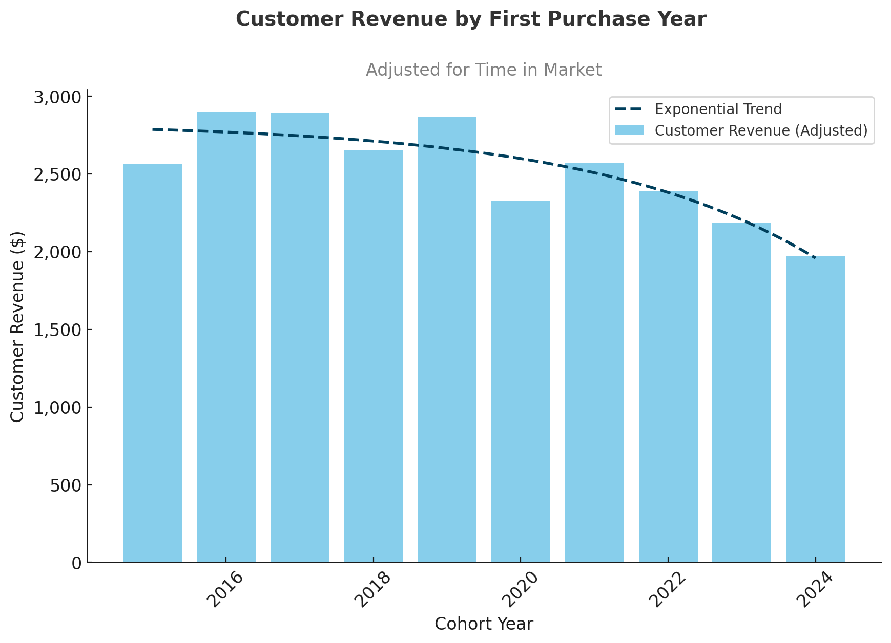

 # Intermediate SQL - Sales Analysis

 ## Overview
An in-depth analysis of customer behavior, retention, and lifetime value to enhance retention strategies and drive revenue growth for an e-commerce company.

## Business Questions

* **Customer Segmentation:** Identifying the most valuable customer groups
* **Cohort Analysis:** Understanding how different cohorts contribute to revenue over time
* **Retention Analysis:** Pinpointing lapsed customers who haven’t made recent purchases

## Cleaning Up Data

 Query: [0_create_view.sql](1_customer_segmentation.sql)

- Aggregated sales and customer data to generate revenue metrics
- Identified first purchase dates for cohort tracking
- Created a unified view linking transactions with customer details

 # Analysis Approach

 ### 1. Customer Segmentation Anaylsis

- Classified customers by total lifetime value (LTV)
- Segmented users into High, Mid, and Low-value groups
- Computed key performance metrics such as total revenue

 Query: [1_customer_segmentation.sql](1_customer_segmentation.sql)

 ## Visualization ##

 

 **Key Findings:**

* High-value segment (25% of customers) contributes 66% of revenue (\$135.4M)
* Mid-value segment (50% of customers) generates 32% of revenue (\$66.6M)
* Low-value segment (25% of customers) accounts for just 2% of revenue (\$4.3M)

 **Business Insights**
- High-Value (66% of revenue): Offer a premium membership program to 12,372 VIP customers—each loss has a significant revenue impact.
- Mid-Value (32% of revenue): Implement personalized upgrade paths to move customers upward, tapping into a $66.6M → $135.4M revenue opportunity.
- Low-Value (2% of revenue): Launch re-engagement and price-sensitive campaigns to drive repeat purchases and lift contribution.

 ### 2. Cohort Analysis
- Tracked revenue and customer count across yearly cohorts
- Grouped customers by their year of first purchase
- Analyzed revenue contribution at the cohort level

 Query: [2_cohort_analysis.sql](/2_cohort_analysis.sql)

 ## Visualization ##

 Customer Revenue by Cohort (Adjusted for time in market) - First Purchase Date

 

 Investigate Monthly Revenue & Customer Trends (3 Month Rolling Average)

 **Key Findings:**
 
* Customer revenue is falling — older cohorts (2016–2018) spent over \$2,800, while the 2024 cohort averages only around \$1,970.
* Both revenue and customer numbers peaked in 2022–2023 but are now declining in 2024.
* Revenue and customer metrics show high volatility, with steep drops in 2020 and 2024, highlighting persistent retention issues.

 **Business Insights:**

* Improve retention and reduce churn by offering personalized incentives to recent cohorts (2022–2024).
* Address revenue instability by launching loyalty programs or subscriptions to promote consistent customer spending.
* Analyze cohort behavior and apply effective tactics from high-value cohorts (2016–2018) to newer groups.

### 3. Customer Retention

- Flagged customers at high risk of churn
- Analyzed patterns in last purchase behavior
- Computed customer-level retention and engagement metrics

 Query: [3_retention_analysis.sql](3_retention_analysis.sql)

 ## Visualization ##

 

 **Key Findings:**
- Churn stabilizes around 90% after 2–3 years, revealing a consistent long-term retention trend.
- Persistently low retention (8–10%) across all cohorts points to systemic retention challenges.
- 2022–2023 cohorts mirror earlier churn patterns, indicating future cohorts are likely to follow suit without targeted intervention.

 **Business Insights**
- Boost early engagement in the first 1–2 years through onboarding incentives, loyalty rewards, and personalized offers to improve long-term retention.
- Prioritize win-back campaigns for high-value churned customers, focusing efforts where ROI is highest rather than broad retention tactics.
- Predict and prevent churn by monitoring customer-specific risk indicators and intervening proactively before users lapse.

 ## Strategic Recommendations

1. **Customer Value Optimization** (Customer Segmentation)  
   - Launch a VIP program targeting 12,372 high-value customers driving 66% of revenue.
   - Develop personalized upgrade paths for mid-value customers to unlock a $66.6M → $135.4M revenue opportunity.
   - Deploy price-sensitive promotions for low-value customers to boost purchase frequency and engagement.

2. **Cohort Performance Strategy** (Customer Revenue by Cohort)  
   - Target 2022–2024 cohorts with personalized re-engagement campaigns to reduce churn.
   - Introduce loyalty or subscription programs to smooth out revenue volatility.
   - Replicate effective tactics from high-spending 2016–2018 cohorts to improve newer cohort performance.
3. **Retention & Churn Prevention** (Customer Retention)  
   - Enhance engagement in the first 1–2 years using onboarding incentives and loyalty rewards.
   - Run targeted win-back campaigns to recover high-value churned customers with high ROI potential.
   - Deploy proactive interventions by detecting churn risk early and engaging at-risk users before they lapse.

## Technical Details

- **Database:** PostgreSQL  
- **Analysis Tools:** PostgreSQL, DBeaver
- **Visualization:** ChatGPT
